# Visual Diagrams

This document contains visual diagrams that illustrate the architecture and data flow of the rendering engine. These diagrams use Mermaid syntax and can be viewed in any Markdown viewer that supports Mermaid (GitHub, VS Code with Mermaid extension, etc.).

## Table of Contents
- [Scene Graph Structure](#scene-graph-structure)
- [Class Hierarchy](#class-hierarchy)
- [Rendering Pipeline Flow](#rendering-pipeline-flow)
- [Data Flow: Vertex to Pixel](#data-flow-vertex-to-pixel)
- [Component Relationships](#component-relationships)

---

## Scene Graph Structure

### Basic Node Types


### Example Scene Graph Tree


**Legend:**
- 🔵 Blue: Container Nodes
- 🔴 Red: Transform Nodes
- 🟢 Green: Geometry Nodes
- 🟡 Yellow: Light Nodes

---

## Class Hierarchy

### Complete Class Structure


---

## Rendering Pipeline Flow

### Frame Processing Sequence


---

## Data Flow: Vertex to Pixel

### Complete Transformation Pipeline


### Vertex Attribute Flow


---

## Component Relationships

### System Architecture Overview


### Lighting System Data Flow

```mermaid
flowchart LR
    subgraph CPU Side
        L1[LightSource Shape] --> L2[Light Position]
        L1 --> L3[Light Color]
        
        L2 --> L4[Transform to Eye-Space]
        L4 --> L5[view × model × pos]
        
        L5 --> L6[Upload to Shader]
        L3 --> L7[Build I_lights Matrix]
        L7 --> L6
        
        M1[Material Properties] --> M2[Build K_materials Matrix]
        M2 --> L6
        
        L6 --> U1[Uniform: lightCoord]
        L6 --> U2[Uniform: I_lights]
        L6 --> U3[Uniform: K_materials]
        L6 --> U4[Uniform: shininess]
    end
    
    subgraph GPU Shader
        U1 --> S1[Fragment Shader]
        U2 --> S1
        U3 --> S1
        U4 --> S1
        
        S1 --> S2[Calculate Light Direction]
        S1 --> S3[Calculate View Direction]
        S1 --> S4[Calculate Reflection]
        
        S2 --> S5[Diffuse = max dot N L]
        S4 --> S6[Specular = pow dot V R]
        
        S5 --> S7[g = diffuse, specular, 0]
        S6 --> S7
        
        S7 --> S8[finalColor = K ⊙ I × g]
        S8 --> S9[Output Color]
    end
    
    style L1 fill:#e1f5ff
    style L6 fill:#ffe1e1
    style S1 fill:#e1ffe1
    style S9 fill:#fff3e1
```



### Scene Graph Traversal

```mermaid
stateDiagram-v2
    [*] --> Root
    
    Root --> CheckNodeType
    
    CheckNodeType --> Node : Is Node
    CheckNodeType --> TransformNode : Is TransformNode
    CheckNodeType --> GeometryNode : Is GeometryNode
    CheckNodeType --> LightNode : Is LightNode
    
    Node --> PassMatrix : Pass parent_matrix unchanged
    TransformNode --> MultiplyMatrix : current = parent × transform
    GeometryNode --> RenderShape : shape.transform() + shape.draw()
    LightNode --> RenderLight : shape.transform() + shape.draw()
    
    PassMatrix --> ProcessChildren
    MultiplyMatrix --> ProcessChildren
    RenderShape --> [*]
    RenderLight --> [*]
    
    ProcessChildren --> CheckNodeType : For each child
    ProcessChildren --> [*] : No more children
```



---

## Matrix Multiplication Chain

### Transformation Sequence

```mermaid
graph LR
    V[Vertex Local Space] -->|Model Matrix| W[World Space]
    W -->|View Matrix| E[Eye Space]
    E -->|Projection Matrix| C[Clip Space]
    C -->|Perspective Divide| N[NDC Space]
    N -->|Viewport Transform| S[Screen Space]
    
    subgraph Scene Graph
        M1[Transform 1] --> M2[Transform 2]
        M2 --> M3[Transform 3]
        M3 --> M4[Final Model = T1 × T2 × T3]
    end
    
    M4 -.->|Accumulated| W
    
    style V fill:#e1f5ff
    style W fill:#ffe1e1
    style E fill:#e1ffe1
    style C fill:#fff3e1
    style N fill:#f0e1ff
    style S fill:#f0f0f0
```



### Example: Rotating Earth Around Sun


---

## Animation System

### Transform Update Flow


### Animation Example


---

## Memory and Resource Management

### OpenGL Resource Lifecycle


### Cleanup Sequence


---

## View the Diagrams

To view these diagrams:

1. **GitHub**: Push to GitHub and view the file - Mermaid renders automatically
2. **VS Code**: Install "Markdown Preview Mermaid Support" extension
3. **Online**: Copy diagram code to https://mermaid.live/
4. **Command line**: Use `mmdc` (mermaid-cli) to generate PNG/SVG files

```bash
# Install mermaid-cli
npm install -g @mermaid-js/mermaid-cli

# Generate diagram images
mmdc -i DIAGRAMS.md -o diagrams.png
```

These diagrams complement the detailed text explanations in `ARCHITECTURE.md` and provide visual understanding of how the rendering engine components interact.
